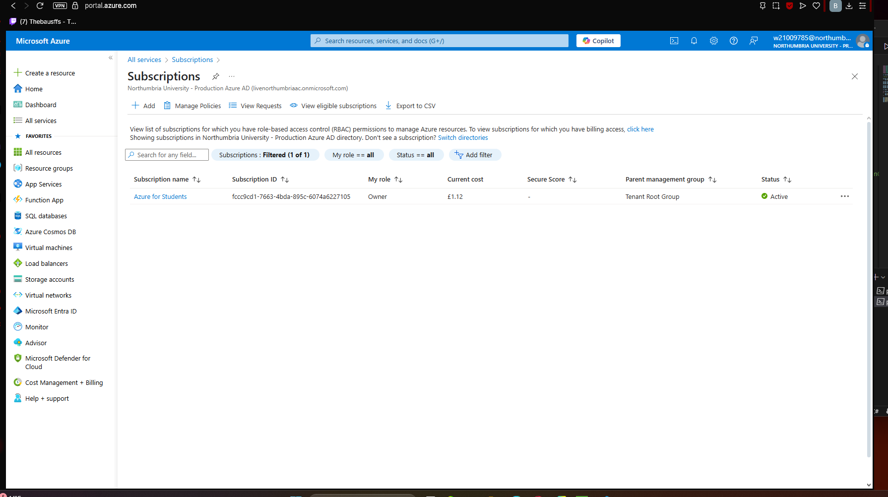
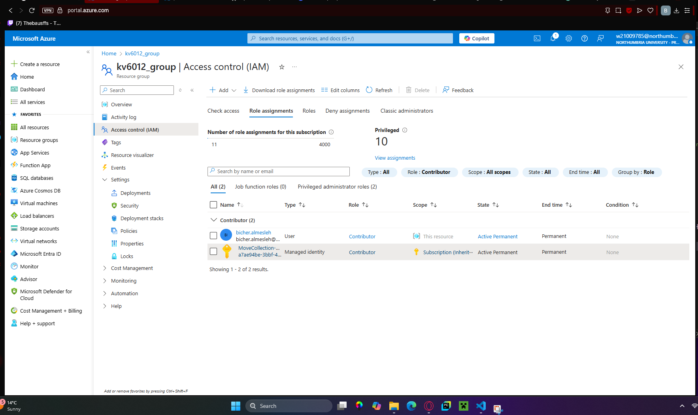
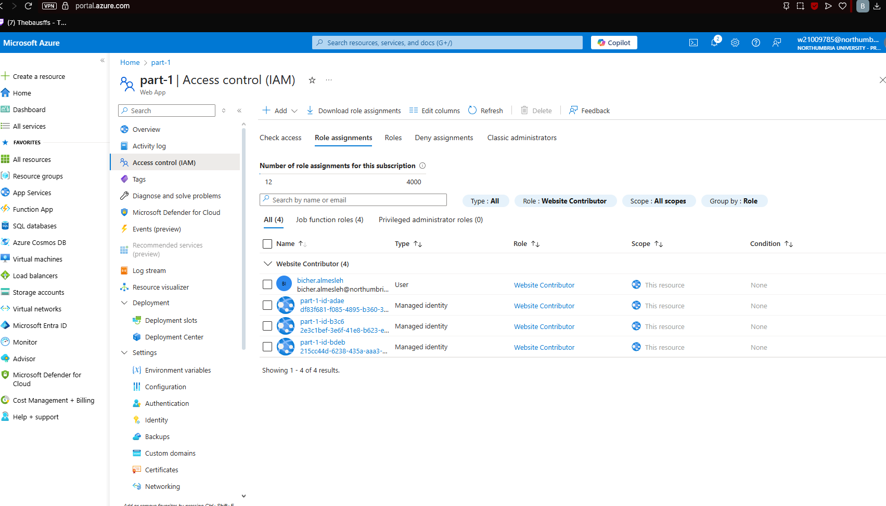
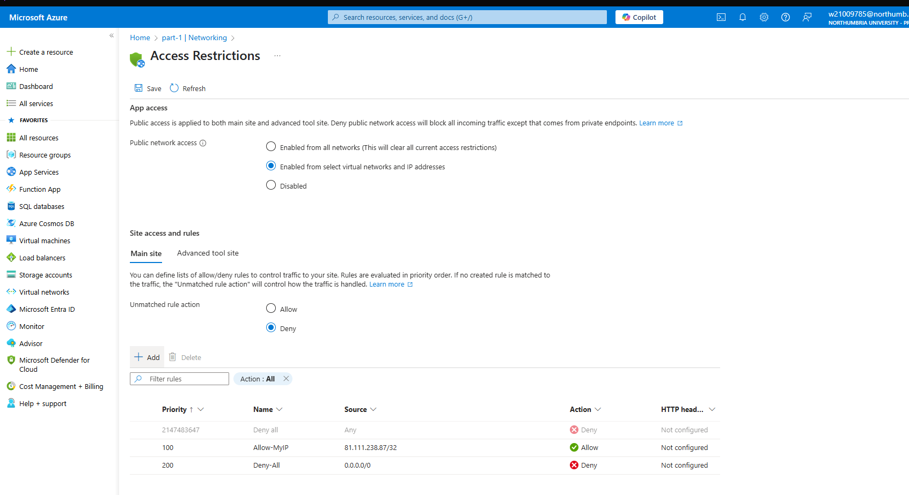

# kv6012assessment
# LINK TO WEBSITE: https://part-1-cme2duajgzaxcnc9.uksouth-01.azurewebsites.net
## Element 1: Roles & Security

To demonstrate a secure, role-based environment in Azure, three user roles have been assigned and network access has been restricted at the App Service level.

### 1. Root account (Subscription Owner)
- **Principal:** bicher.almesleh@northumbriaac.onmicrosoft.com  
- **Role:** Owner  
- **Scope:** Azure for Students subscription  


### 2. Admin account (Resource-group Contributor)
- **Principal:** bicher.almesleh@northumbriaac.onmicrosoft.com  
- **Role:** Contributor  
- **Scope:** Resource group `kv6012_group`  


### 3. Web-Admin account (Website Contributor)
- **Principal:** bicher.almesleh@northumbriaac.onmicrosoft.com  
- **Role:** Website Contributor  
- **Scope:** App Service `part-1`  



### 4. Project Overview & Contents
Shows each project’s title, description, aggregated CO₂ emissions and total cost, plus a separate “Contents” table sourced from CSV files listing each resource and its quantity. Evidence is on the live site.

### 5. Location Map
Uses Leaflet with OpenStreetMap tiles to centre on the project’s coordinates and place a marker that updates on selection. Evidence is on the live site.

### 6 and 7. Live Weather, Air Quality & Recommendations
Fetches current weather and AQI for the project location; displays temperature, wind speed, AQI and a conditional advisory (“High wind – crane not advised,” “Poor AQI – delay operations,” or “Conditions normal”). Evidence is on the live site.

### 8. 8-Day Forecast & Historical Lookup
Displays an eight-day forecast from the daily endpoint, and provides a date picker to fetch historical weather/AQI for any chosen date. Evidence is on the live site.
---
### extra notes:
the co2 does not work because there is not much data, and the cost is still being calculated on the azure website. 
The data history selector seems to be working but not becasue of whay i assume is the api key, a paid one might work.

## Network Access Restrictions

Public network access is limited to specific IPs, with all other traffic denied by default.

- **Public network access:** Enabled from select virtual networks and IP addresses  
- **Unmatched rule action:** Deny  

| Priority | Name        | Source             | Action |
| -------- | ----------- | ------------------ | ------ |
| 100      | Allow-MyIP  | 81.111.238.87/32   | Allow  |
| 200      | Deny-All    | 0.0.0.0/0          | Deny   |



## Element 2: Infrastructure as Code

We define our core dashboard infrastructure via an ARM template:

- `iac/azuredeploy.json` – declares the App Service Plan, Web App (with system-assigned identity) and network access restrictions  
- `iac/azuredeploy.parameters.json` – provides parameter values (region, plan name, site name, allowed IP)

Deployment command:

```bash
az deployment group create \
  --resource-group kv6012_group \
  --template-file ./iac/azuredeploy.json \
  --parameters @./iac/azuredeploy.parameters.json


## References

OpenWeatherMap (2025) *OpenWeatherMap API*. Available at: https://openweathermap.org/api (Accessed: 19 May 2025).

Air Quality Open Data Platform (2025) *World Air Quality Index (WAQI) API*. Available at: https://aqicn.org/api/ (Accessed: 19 May 2025).

Agafonkin, V. (2025) *Leaflet – an open-source JavaScript library for interactive maps*. Available at: https://leafletjs.com/ (Accessed: 19 May 2025).
